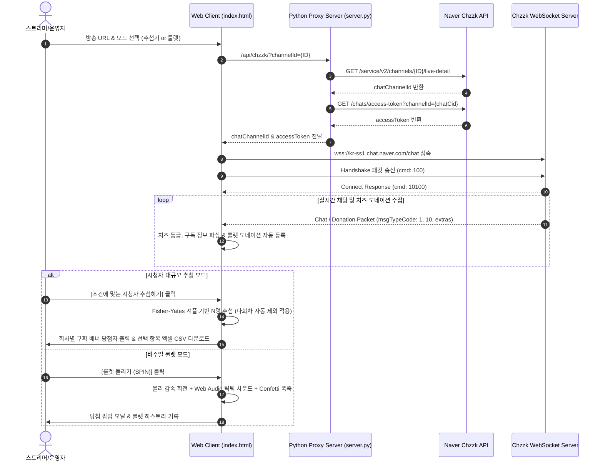

# 🎮 치지직 대규모 시청자 추첨 & 비주얼 룰렛 시스템 (Chzzk Mega Raffle & Roulette) v2.0.0


네이버 **치지직(Chzzk)** 라이브 방송 채팅창과 웹소켓(WebSocket)으로 직접 연결하여 **치즈 후원자(10만~1억 치즈 등급), 구독자(개월 수/티어)** 등 다양한 조건으로 시청자를 실시간 분류하고 **수백~수천 명 이상을 중복 없이 공정하게 일괄 추첨**하며, **수동 입력 및 실시간 치즈 도네이션 연동 비주얼 룰렛(Roulette Wheel)**까지 완벽 지원하는 올인원 방송 보조 도구입니다.

---

## 🌟 핵심 기능 (Key Features)

### 🎟️ 1. 시청자 대규모 추첨기 (Mega Raffle)
- **⚡ 실시간 웹소켓(WebSocket) 채팅 수집**: 방송 URL 또는 채널 ID만 입력하면 실시간 채팅 메시지를 초고속 수집합니다.
- **🧀 치즈 후원자 전용 추첨 (Cheese Donator Filter)**:
  - 팬 배지 및 일반 치즈 후원자 전체 대상 추첨
  - 치즈 누적 후원 등급별 정밀 필터링:
    - **일반 후원자 이상 (LV1+)**
    - **🔥 10만 치즈 이상 (LV2+)**
    - **🔥 100만 치즈 이상 (LV3+)**
    - **💖 1,000만 치즈 이상 (LV4+)**
    - **✨ 1억 치즈 이상 (LV5+)**
- **⭐ 구독자 전용 추첨 (Subscription Filter)**:
  - **최소 구독 개월 수 지정** (예: 3개월 이상 연속 구독자)
  - **구독 티어 지정** (1티어 이상 또는 2티어 전용)
- **🔄 다회차 중복 당첨 방지 & 강력한 제외 설정**:
  - **이전 회차 당첨자 자동 제외**: 1회차, 2회차 등 다회차 추첨 시 이전 회차 당첨자는 고유 ID 기반으로 100% 자동 차단
  - **과거 당첨자 엑셀/CSV 파일 제외**: 엑셀/CSV 파일 드래그 앤 드롭으로 이전 당첨자 일괄 제외
  - **수동 직접 제외**: 닉네임 및 고유 ID 표 대조로 특정 사용자 개별 제외
- **🏆 회차별 당첨자 구획 배너 & 배지 표기**:
  - 추첨회차마다 `🏆 제 N 회차 당첨자` 네온 구분 배너 자동 표시
  - 당첨자 항목마다 `🎉 N회차` 태그 배지 시각적 표시
- **📊 엑셀 커스텀 내보내기 (`⚙️ 항목 선택` 기능)**:
  - `순위`, `추첨회차`, `닉네임`, `구독여부`, `구독개월`, `구독티어`, `후원여부`, `후원등급`, `채팅내용`, `참여시간`, `고유식별자(UID)` 등 11개 항목 중 원하는 항목만 선택하여 한글 깨짐 없이 UTF-8 BOM CSV 추출

---

### 🎰 2. 비주얼 룰렛 시스템 (Visual Roulette Engine) - `NEW in v2.0.0`
- **✍️ 수동 직접 입력 룰렛 (Manual Mode)**:
  - 줄바꿈으로 경품, 벌칙, 메뉴 등 원하는 항목을 자유롭게 입력 (`항목:가중치` 형식으로 확률 차등 적용 가능)
  - 원클릭 빠른 프리셋 제공 (`🎁 경품 세트`, `🔥 벌칙 세트`, `🍱 메뉴 선택`)
  - **👥 추첨 참여자 불러오기**: 현재 수집된 유효 응모자 명단을 버튼 하나로 룰렛 원판에 즉시 로드
- **🧀 치지직 치즈 도네이션 실시간 연동 룰렛 (Donation Mode)**:
  - 방송 중 시청자가 치즈를 후원하는 순간 룰렛 원판에 실시간 자동 등록
  - **후원자 닉네임 모드** (후원자 대상 추첨) & **후원 메시지 모드** (시청자 추천 벌칙/미션 모음)
  - 최소 후원 치즈 금액 컷 설정 (예: `1,000 치즈 이상`)
  - 후원 금액 비례 가중치 옵션 (치즈 후원 금액에 따라 룰렛 칸 넓이 자동 확장)
- **🎨 HTML5 캔버스 고해상도 원판 & 물리 감속 회전**:
  - 고대비 네온/파스텔 그라데이션 컬러 및 자동 폰트 크기 조절
  - 부드러운 감속 곡선(`Ease-Out Quartic`)을 적용한 쫄깃한 회전 연출 (3초 / 5초 / 8초 시간 조절)
- **🔊 Web Audio API 무설치 사운드 신디사이저**:
  - 외부 음원 파일 없이 브라우저에서 직접 합성하는 리얼한 틱틱 회전음 & 당첨 축하 팡파레
- **🎉 당첨 축하 폭죽(Confetti) & 모달**:
  - 당첨 순간 화면 전체에 터지는 140여 개의 화려한 파티클 폭죽 가루
  - `🗑️ 당첨된 항목 룰렛에서 자동 제거` 옵션으로 중복 당첨 완벽 방지
  - 룰렛 당첨 히스토리 기록 관리

---

## 🏗️ 시스템 아키텍처 (Architecture)



---

## 🚀 실행 방법 (Execution Guide)

### 1. `.exe` 실행 파일로 바로 실행하기 (Windows 추천)
- `dist/치지직추첨기.exe` (또는 Releases에서 다운로드한 `치지직추첨기.exe`) 파일을 **더블 클릭**만 하시면 됩니다.
- 파이썬이나 기타 부가 프로그램 설치가 전혀 필요 없는 독립형 무설치 실행 파일입니다.

---

### 2. 파이썬 소스 코드로 실행하기 (Mac / Linux / Windows 공통)
파이썬 표준 라이브러리만 사용하므로 별도의 `pip install` 없이 바로 실행 가능합니다.

- **필수 조건**: Python 3.9 이상
- **실행 명령어**:
  ```bash
  # 저장소 클론 후 이동
  git clone https://github.com/dlwjdxor/chzzk-raffle-app.git
  cd chzzk-raffle-app

  # 서버 실행 (Windows: python server.py / Mac & Linux: python3 server.py)
  python server.py
  ```
- 서버가 실행되면 웹 브라우저에서 **`http://localhost:8000`** 페이지가 자동으로 열립니다.

---

## 💻 실행 파일(.exe) 다시 빌드하기

```bash
pip install pyinstaller
python -m PyInstaller --noconfirm --onefile --name "치지직추첨기" --add-data "public;public" server.py
```
