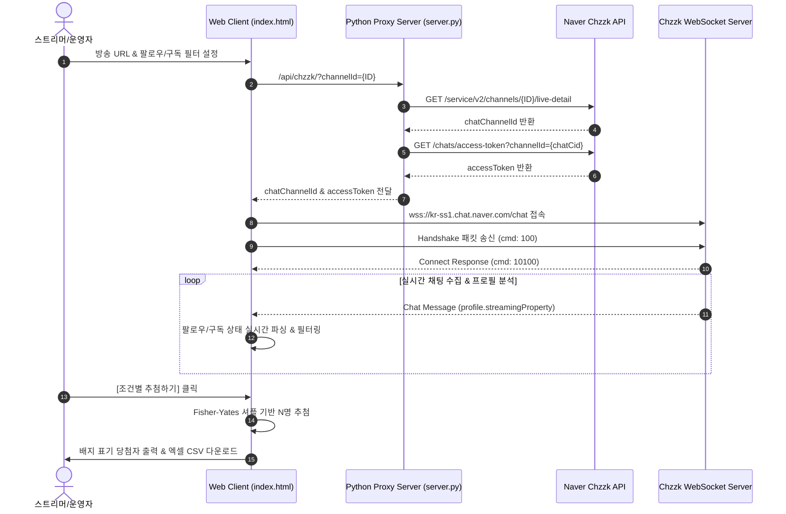

# 🎮 치지직 대규모 시청자 추첨 시스템 (Chzzk Mega Raffle System)


네이버 **치지직(Chzzk)** 라이브 방송 채팅창과 웹소켓(WebSocket)으로 직접 연결하여 **팔로우 여부/기간, 구독 여부/기간/티어** 등 다양한 조건으로 시청자를 실시간 분류하고 **수백~수천 명 이상을 중복 없이 공정하게 일괄 추첨**하는 고급 웹 애플리케이션입니다.

---

## 🌟 핵심 기능 (Key Features)

- **⚡ 실시간 웹소켓(WebSocket) 채팅 수집**: 방송 URL 또는 채널 ID만 입력하면 실시간 채팅 메시지를 초고속 수집합니다.
- **🛡️ 자동 중복 및 도배 방지 (Deduplication)**: 시청자가 채팅을 여러 번 쳐도 유저 고유 식별자(`userIdHash`)를 기준으로 1회만 응모 처리됩니다.
- **❤️ 팔로우 상세 필터링**:
  - **팔로워 전용 추첨** 옵션
  - **최소 팔로우 기간 지정** (예: 30일 이상 팔로우한 팬만 추첨)
- **⭐ 구독 상세 필터링**:
  - **구독자 전용 추첨** 옵션
  - **최소 구독 개월 수 지정** (예: 3개월 이상 연속 구독자만 추첨)
  - **구독 티어 지정** (1티어 이상 또는 2티어 전용 추첨)
- **🎯 키워드 필터링**: `!추첨`, `!참여` 등 원하는 키워드를 지정하거나, 빈칸으로 두어 전 시청자를 대상으로 수집할 수 있습니다.
- **🎁 대규모 일괄 무작위 추첨**: 1명부터 5,000명+ 이상까지 **Fisher-Yates 셔플 알고리즘**을 통해 편향 없는 무작위 추첨을 수행합니다.
- **📊 엑셀(CSV) 다운로드**: 당첨자 명단 및 **구독 상태, 구독 개월, 팔로우 기간** 정보를 UTF-8 BOM 엑셀 CSV 파일로 원클릭 저장합니다.

---

## 🏗️ 시스템 아키텍처 (Architecture)



---

## 🚀 로컬 실행 방법 (Local Run)

### Requirements
- Python 3.9 이상 (Standard Library 사용)

### Execution
```bash
# 1. 저장소 클론
git clone https://github.com/dlwjdxor/chzzk-raffle-app.git
cd chzzk-raffle-app

# 2. 서버 실행
python server.py
```
서버가 실행되면 자동으로 브라우저에서 `http://localhost:8000` 이 열립니다.

---

## 💻 실행 파일(.exe) 다시 빌드하기

```bash
pip install pyinstaller
python -m PyInstaller --noconfirm --onefile --name "치지직추첨기" --add-data "public;public" server.py
```
생성된 `dist/치지직추첨기.exe` 파일을 더블 클릭만 하면 파이썬 없이 바로 실행할 수 있습니다.

---

## 📄 License
This project is open-source and available under the [MIT License](LICENSE).
