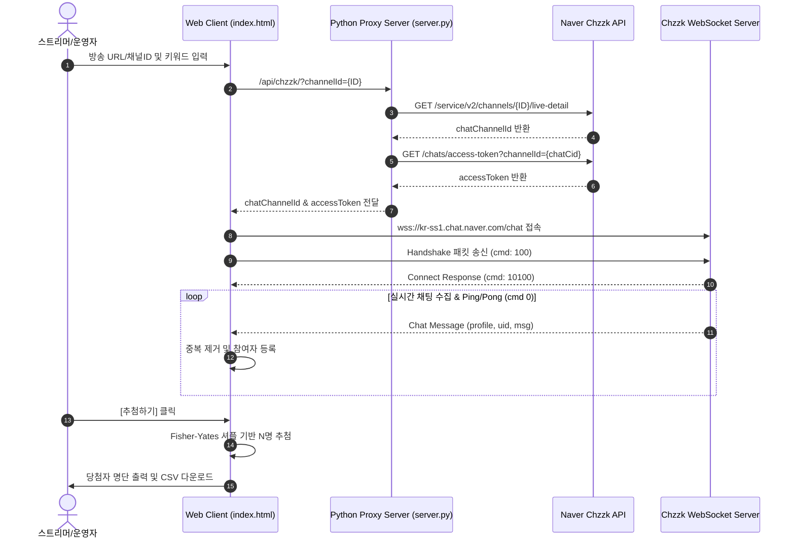

# 🎮 치지직 대규모 시청자 추첨 시스템 (Chzzk Mega Raffle System)


네이버 **치지직(Chzzk)** 라이브 방송 채팅창과 웹소켓(WebSocket)으로 직접 연결하여 **수백~수천 명 이상의 시청자를 중복 없이 실시간 수집하고 공정하게 일괄 추첨**하는 웹 애플리케이션입니다.

---

## 🌟 핵심 기능 (Key Features)

- **⚡ 실시간 웹소켓(WebSocket) 채팅 수집**: 방송 URL 또는 채널 ID만 입력하면 실시간 채팅 메시지를 초고속 수집합니다.
- **🛡️ 자동 중복 및 도배 방지 (Deduplication)**: 시청자가 채팅을 여러 번 쳐도 유저 고유 식별자(`userIdHash`)를 기준으로 1회만 응모 처리됩니다.
- **🎯 키워드 필터링 (Keyword Filtering)**: `!추첨`, `!참여` 등 원하는 키워드를 지정하거나, 빈칸으로 두어 전 시청자를 대상으로 수집할 수 있습니다.
- **🎁 대규모 일괄 무작위 추첨**: 1명부터 500명+ 이상까지 **Fisher-Yates 셔플 알고리즘**을 통해 편향 없는 무작위 추첨을 수행합니다.
- **📊 엑셀(CSV) 다운로드**: 추첨된 당첨자 명단 (순위, 닉네임, 채팅 내용, 참여 시간, UID)을 UTF-8 BOM 엑셀 CSV 파일로 원클릭 저장합니다.
- **🎨 네온 글래스모피즘 UI**: 방송 화면이나 브라우저에 띄우기 최적화된 다크 모드 프리미엄 웹 인터페이스를 제공합니다.

---

## 🏗️ 시스템 아키텍처 (Architecture)



---

## 🚀 로컬 실행 방법 (Local Run)

### Requirements
- Python 3.9 이상 (추가 외부 라이브러리 설치 불필요 - Standard Library 사용)

### Execution
```bash
# 1. 저장소 클론
git clone https://github.com/YOUR_USERNAME/chzzk-raffle-app.git
cd chzzk-raffle-app

# 2. 서버 실행
python server.py
```
서버가 실행되면 자동으로 브라우저에서 `http://localhost:8000` 이 열립니다.

---

## ☁️ 무료 웹 호스팅에 배포하기 (Deployment)

이 프로젝트는 별도의 DB나 복잡한 빌드 과정이 없어 **무료 호스팅 서비스(Render, Vercel, Railway 등)**에 1분 만에 배포가 가능합니다.

### 🌐 Render.com 배포 방법 (추천)
1. GitHub에 이 레포지토리를 업로드합니다.
2. [Render.com](https://render.com)에 로그인 후 **[New] -> [Web Service]**를 클릭합니다.
3. 내 GitHub 계정을 연결하고 `chzzk-raffle-app` 레포지토리를 선택합니다.
4. 아래 설정을 입력 후 **[Create Web Service]** 클릭:
   - **Environment**: `Python 3`
   - **Build Command**: `pip install -r requirements.txt` (또는 빈칸)
   - **Start Command**: `python server.py`
5. 몇 초 후 생성된 무료 웹주소 (예: `https://chzzk-raffle.onrender.com`)를 누구에게나 공유하면 됩니다!

---

## 📋 API & 웹소켓 프로토콜 사양

### 1. 방송 상세 정보 가져오기
- **Endpoint**: `GET https://api.chzzk.naver.com/service/v2/channels/{channelId}/live-detail`
- **Header**: `User-Agent: Mozilla/5.0`

### 2. 채팅 Access Token 발급
- **Endpoint**: `GET https://comm-api.game.naver.com/nng_main/v1/chats/access-token?channelId={chatChannelId}&chatType=STREAMING`

### 3. WebSocket Handshake Packet
- **Server**: `wss://kr-ss1.chat.naver.com/chat`
- **Origin Header**: `https://chzzk.naver.com`
- **Payload (`cmd: 100`)**:
  ```json
  {
    "ver": "2",
    "cmd": 100,
    "svcid": "game",
    "cid": "{chatChannelId}",
    "bdy": {
      "accTkn": "{accessToken}",
      "auth": "READ",
      "devType": 2001,
      "uid": null
    },
    "tid": 1
  }
  ```

---

## 📄 License
This project is open-source and available under the [MIT License](LICENSE).
