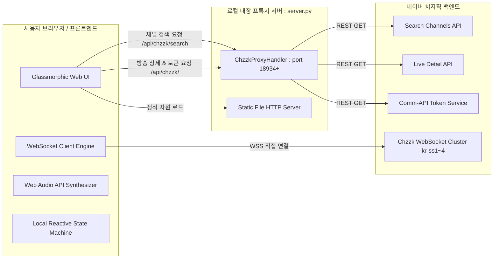
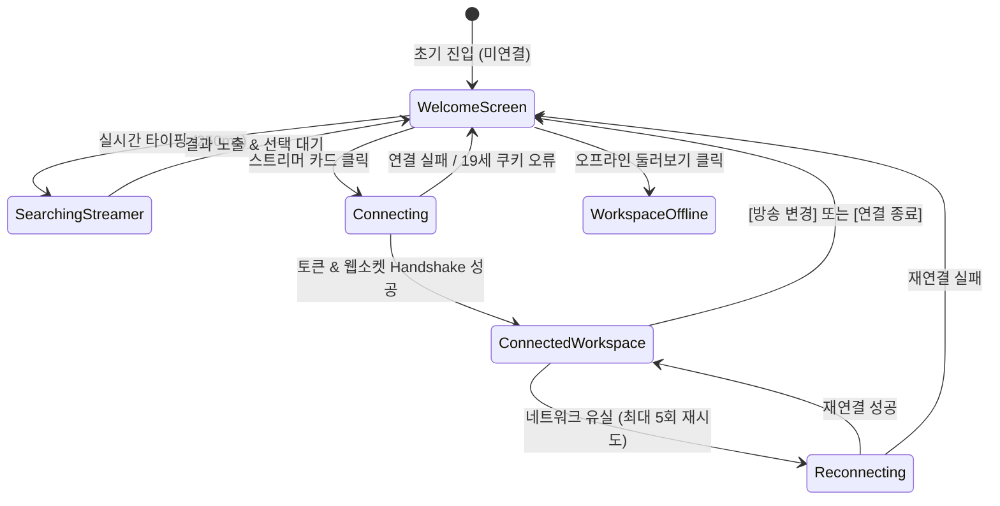

# 🏗️ 아키텍처 및 실시간 프로토콜 상세 명세서 (Architecture & Protocol Specification)

- **문서 버전**: v4.8.0
- **작성일자**: 2026-09-03
- **대상**: 개발자, 시스템 아키텍트, 연동 엔지니어

---

## 1. 시스템 전체 아키텍처

치지직 인터랙티브 스튜디오는 **경량 로컬 프록시 서버(Python)**와 **순수 웹 프론트엔드(Vanilla HTML5/CSS/JS)**의 2-Tier 구조로 구성됩니다.



---

## 2. 로컬 프록시 서버 명세 (`server.py`)

브라우저 환경의 CORS(Cross-Origin Resource Sharing) 제약을 해결하고 보안 헤더를 주입하기 위해 로컬 HTTP 서버가 중간 중계자 역할을 수행합니다.

### 2.1 채널 실시간 검색 엔드포인트
- **경로**: `GET /api/chzzk/search?keyword={검색어}`
- **목적**: 스트리머 닉네임으로 치지직 공식 검색 API를 쿼리하고 팔로워 순으로 정렬하여 반환.
- **원격 URL**: `https://api.chzzk.naver.com/service/v1/search/channels?keyword={quote(keyword)}&offset=0&size=30`
- **응답 페이로드 스키마**:
```json
{
  "channels": [
    {
      "channelId": "bb382c2c0cc9fa7c86ab3b037fb5799c",
      "channelName": "침착맨",
      "channelImageUrl": "https://nng-phinf.pstatic.net/...",
      "followerCount": 323956,
      "openLive": false,
      "verifiedMark": true
    }
  ]
}
```
- **정렬 규칙**: 백엔드에서 `channels.sort(key=lambda x: x.get('followerCount', 0), reverse=True)`를 수행하여 항상 팔로워 수가 가장 많은 채널이 인덱스 0번에 위치하도록 보장.

### 2.2 방송 상세 정보 및 웹소켓 토큰 획득 엔드포인트
- **경로**: `GET /api/chzzk/?channelId={채널ID}&nidAuth={NID_AUT}&nidSes={NID_SES}`
- **동작 절차**:
  1. `https://api.chzzk.naver.com/service/v2/channels/{channel_id}/live-detail` 호출하여 방송 상태(`OPEN`/`CLOSE`), `chatChannelId`, 시청자 수, 방송 제목, 카테고리 추출.
  2. 19세 방송 제한 감지: 응답 코드가 4001이거나 본문이 빈 경우, 클라이언트에 `{ isAdult: true, error: "..." }` 반환하여 쿠키 입력 유도.
  3. `https://comm-api.game.naver.com/nng_main/v1/chats/access-token?channelId={chatChannelId}&chatType=STREAMING` 호출하여 웹소켓 접근 토큰(`accessToken`, `extraToken`) 발급.

---

## 3. 치지직 웹소켓 실시간 채팅 프로토콜 (WebSocket Protocol)

### 3.1 웹소켓 서버 클러스터
- 기본 도메인: `wss://kr-ss{1..4}.chat.naver.com/chat`
- 로드 밸런싱: `channelId` 해시 값에 기반하여 1~4번 서버로 분산 접속.

### 3.2 핵심 커맨드(CMD) 패킷 구조

#### ① 연결 및 핸드셰이크 (CMD: 100)
클라이언트가 웹소켓에 접속한 직후 즉시 전송하는 패킷:
```json
{
  "ver": "2",
  "cmd": 100,
  "svcid": "game",
  "cid": "{chatChannelId}",
  "bdy": {
    "uid": null,
    "devType": 2001,
    "accTkn": "{accessToken}",
    "auth": "READ"
  },
  "tid": 1
}
```

#### ② 하트비트 핑/퐁 (CMD: 10000 & 10100)
- 주기: 매 20초마다 클라이언트가 `{"ver": "2", "cmd": 10000}` 전송.
- 서버 응답: `{"ver": "2", "cmd": 10100}` 수신 시 연결 유지 확인.

#### ③ 실시간 채팅 수신 (CMD: 93101)
서버에서 실시간으로 푸시되는 시청자 채팅 패킷 (JSON 파싱 후 각 피드로 디스패치):
- `profile`: 닉네임, 유저 해시 UID, 활동 뱃지 정보.
- `msg`: 실제 채팅 텍스트.
- `extras`: 구독 개월 수(`accumulativeMonth`), 구독 티어(`tier`), 치즈 후원 금액(`payAmount`).

#### ④ 치즈 후원(도네이션) 수신 (CMD: 93102)
서버에서 실시간으로 푸시되는 치즈 후원 패킷. 미션 룰렛 및 투표 가중치로 자동 환산.

---

## 4. 클라이언트 상태 머신 (Client State Machine)



---

## 5. 보안 및 데이터 보호 정책

1. **쿠키 취급**: NID_AUT 및 NID_SES는 외부 서버로 전송되지 않으며, 사용자의 로컬 `server.py` 프록시를 통해 네이버 공식 엔드포인트로만 안전하게 전달됩니다.
2. **XSS 방지**: 시청자 채팅 닉네임, 메시지, 도감 텍스트 등 모든 동적 렌더링 영역에 `escapeHtml()` 함수를 강제 적용하여 악성 스크립트 실행을 원천 차단합니다.
