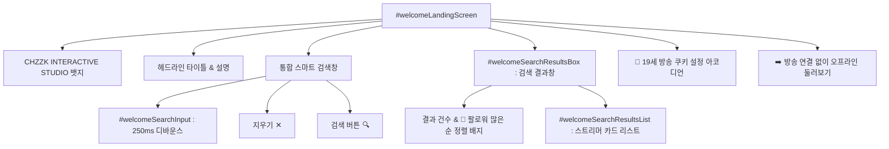

# 🔍 온보딩 시작 화면 및 채널 실시간 검색 설계서 (Welcome Onboarding & Search Engine)

- **문서 버전**: v4.8.0
- **작성일자**: 2026-09-03
- **대상**: 프론트엔드 엔지니어, UI/UX 디자이너

---

## 1. 개요 및 설계 목적

기존 버전에서는 앱 진입 시 복잡한 추첨/게임 작업대가 바로 노출되어 첫 사용자에게 인지 부하를 주었습니다. v4.8.0에서는 **단독 시작 화면(Welcome Landing Screen)**을 도입하여, 사용자가 스트리머 닉네임만으로 1초 만에 방송에 연결하거나 오프라인으로 둘러볼 수 있는 직관적인 온보딩 경험을 제공합니다.

---

## 2. 화면 구성 요소



---

## 3. 핵심 알고리즘 및 동작 흐름

### 3.1 실시간 타이핑 즉시 자동 검색 (250ms Debounced Search)
- 사용자가 엔터키나 [검색] 버튼을 누르지 않아도, 타이핑이 감지되면 250ms 타이머를 시작합니다.
- 사용자가 계속 입력 중이면 이전 타이머를 취소(`clearTimeout`)하고 새 타이머를 설정합니다.
- 250ms 동안 추가 입력이 없으면 자동으로 `executeWelcomeSearch(true)`를 호출하여 서버 프록시로 검색을 요청합니다.

```javascript
let searchDebounceTimer = null;

function handleWelcomeSearchInput(val) {
  const clearBtn = document.getElementById('welcomeClearSearchBtn');
  if (clearBtn) clearBtn.style.display = val ? 'block' : 'none';

  if (searchDebounceTimer) {
    clearTimeout(searchDebounceTimer);
    searchDebounceTimer = null;
  }

  const q = (val || '').trim();
  if (!q) {
    const resBox = document.getElementById('welcomeSearchResultsBox');
    if (resBox) resBox.style.display = 'none';
    return;
  }

  searchDebounceTimer = setTimeout(() => {
    executeWelcomeSearch(true);
  }, 250);
}
```

### 3.2 팔로워 수 기준 내림차순 정렬 (`followerCount` Descending)
- 치지직에는 동명이인, 팬 채널, 클립 채널이 다수 존재할 수 있습니다.
- 백엔드와 프론트엔드 양측에서 `channels.sort((a, b) => (b.followerCount || 0) - (a.followerCount || 0))`를 적용하여, **공식 채널/본계정이 항상 맨 위에 노출**되도록 정렬을 강제합니다.
- 팔로워 수 표시 포맷터 `formatFollowerCount(num)`:
  - 10,000명 이상: `32.4만명`, `7.5만명`
  - 10,000명 미만: `1,378명`

### 3.3 스트리머 카드 UI 렌더링
각 스트리머 카드에는 다음 정보가 고해상도로 렌더링됩니다:
- 스트리머 프로필 아바타 (원형 보더)
- 스트리머 닉네임
- 치지직 공식 인증 마크 (`✓`)
- 실시간 방송 상태 뱃지 (`🔴 LIVE` / `⚪ OFFLINE`)
- 팔로워 수 및 채널 고유 ID
- 원클릭 `[ 연결 ➔ ]` 액션 버튼

---

## 4. 뷰 전환 제어 (View Transition Flow)

### 4.1 작업대 진입 (`enterWorkspace()`)
- 시작 화면(`#welcomeLandingScreen`)을 `display: none`으로 전환.
- 메인 작업대(`#appWorkspaceArea`)를 `display: block`으로 전환.
- 상단 헤더의 복귀 버튼(`#welcomeBackToWorkspaceBtn`)을 활성화.
- `sessionStorage.setItem('entered_workspace', 'true')`로 새로고침 시 상태 복원 지원.

### 4.2 방송 변경 및 복귀 (`openChangeChannelScreen()` & `returnToWorkspace()`)
- 작업대 헤더의 `[ 📡 방송 변경 ]` 버튼을 누르면 즉시 시작 화면이 다시 나타납니다.
- 마음이 바뀌어 진행 중이던 추첨/게임으로 돌아가고 싶을 때는 우측 상단의 `[ ✕ 작업대로 복귀 ]` 버튼을 누르면 작업대 상태가 그대로 유지된 채 복귀됩니다.
