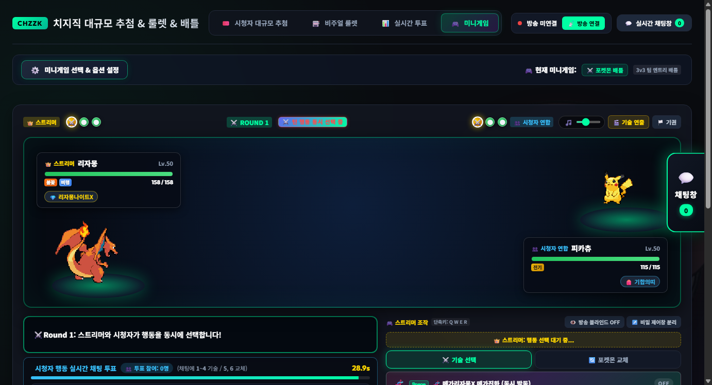
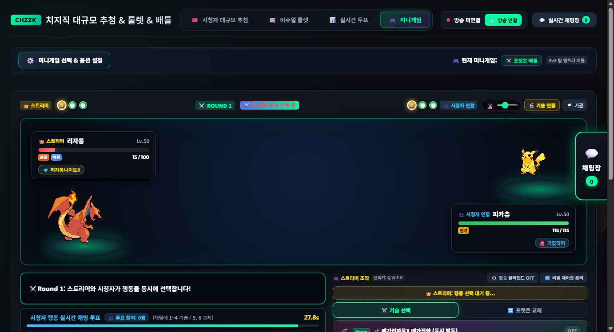
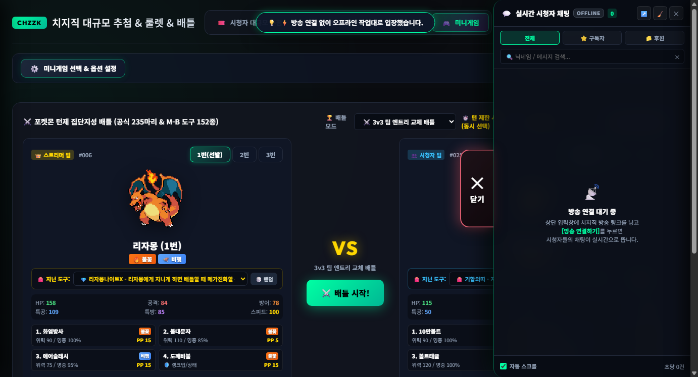
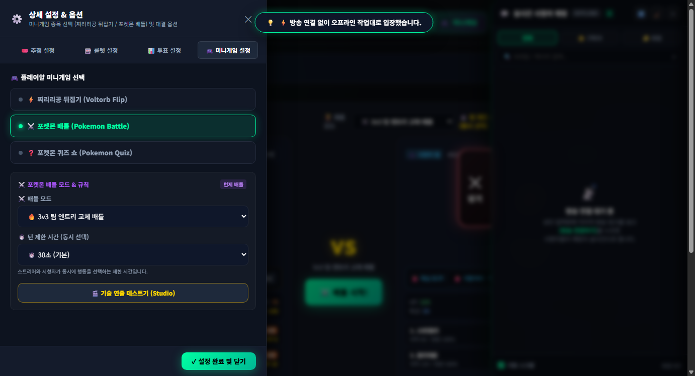
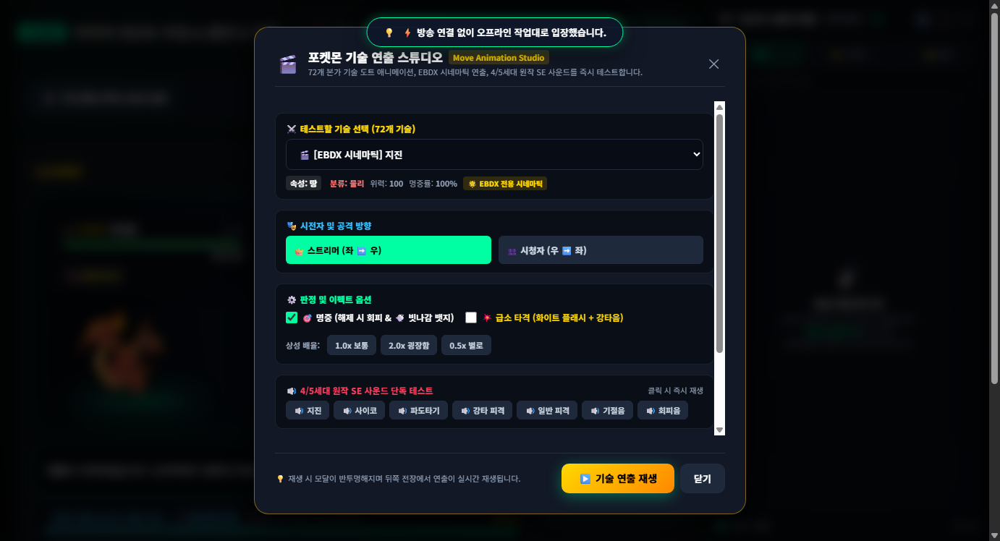
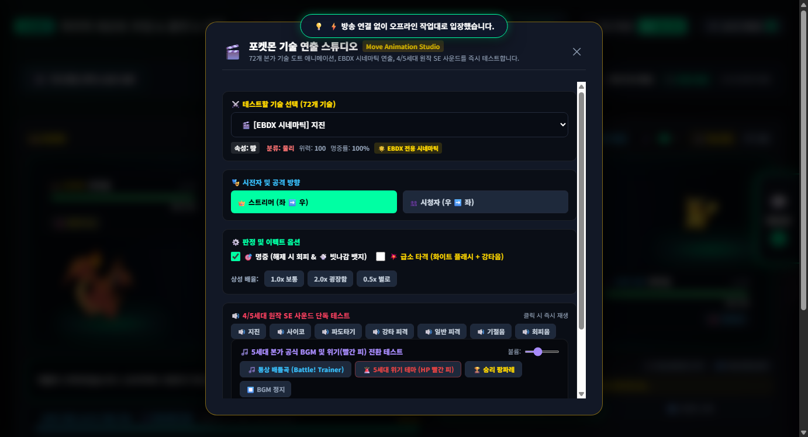
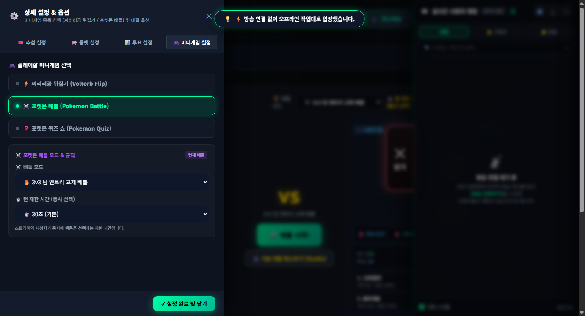

# 🚀 치지직 방송 플랫폼 v5.0.0 릴리즈 노트 (Release Notes)

## 📌 개요 (Overview)
- **버전**: v5.0.0 (Major Release)
- **배포일자**: 2026년 9월 8일
- **핵심 키워드**: 포켓몬 5세대 본가 공식 BGM 엔진, 위기(빨간 피) 동적 크로스페이드, 포케로그 72종 도트 애니메이션 & EBDX 시네마틱 연출, 옵션창 DOM 복구, 기술 연출 스튜디오 설정 서랍 이전, 단독 실행 파일(EXE) 일체화

---

## 🎵 1. 포켓몬 5세대 공식 BGM & 위기(빨간 피) 동적 전환 엔진

포켓몬스터 본가 닌텐도 DS 5세대(블랙·화이트) 공식 오리지널 사운드트랙(Super Music Collection, GAME FREAK 2010)에서 검증된 정식 음원 3종을 로컬에 영구 내장하고, **「생존 1마리 + 체력 20% 이하(빨간 피)」 조건 시 긴박한 위기 BGM으로 부드럽게 크로스페이드되는 동적 전환 엔진**을 구현했습니다.

### ① 채택된 공식 음원 (100% Authentic Reference)
- **통상 배틀곡**: gm_battle_trainer.mp3 (5.3 MB)
  - 트랙명: Battle! (Trainer) (작곡: 마스다 준이치 / 카게야마 쇼타)
  - 배틀 시작 시 자동으로 페이드인되어 루프로 반복 재생됩니다.
- **위기 BGM (급박/긴장)**: gm_battle_low_hp.mp3 (991 KB)
  - 트랙명: A Tight Spot During Battle! (원제: 戦い（ピンチ！） / 공식 한글명: 전투! (위기!), 작곡: 카게야마 쇼타)
  - **5세대 본가 시그니처 시스템**: 체력이 위험 구간(20% 이하)에 도달했을 때 비트와 경보 사이렌이 결합된 긴장감 넘치는 테마로 실시간 교체됩니다.
- **승리 팡파레**: gm_victory_trainer.mp3 (985 KB)
  - 트랙명: Victory! (Trainer) (작곡: 마스다 준이치)
  - 상대 팀 전원 기절 시 단발 재생되는 공식 승리 테마입니다.

### ② 동적 전환 알고리즘 & 기술 사양
- **상태 감지 조건 (checkPokeBattleBgmCondition)**:
  - liveCount === 1: 스트리머 팀의 3마리 중 기절하지 않은 포켓몬이 정확히 1마리일 때
  - currentHP / maxHP <= 0.20: 현재 출전 포켓몬의 잔여 체력이 20% 이하(빨간 피)일 때
- **500ms 듀얼 크로스페이드 (Crossfade)**:
  - 통상곡의 볼륨을 0으로 점진 감쇠(gain.linearRampToValueAtTime)함과 동시에 위기곡을 페이드인하여 끊김 없는 음악 전환을 보장합니다.
  - 체력이 회복 기술(날개쉬기, 달의불빛 등)이나 도구로 20%를 초과하면 자동으로 통상 배틀곡으로 부드럽게 복귀합니다.
- **경기장 헤더 BGM 캡슐**:
  - 경기장 헤더 우측에 🎵 [—O—] 컨트롤러를 배치하여 마우스 클릭 한 번으로 음소거 및 볼륨 조절이 가능하며, 위기 상황 돌입 시 아이콘이 경보 사이렌(🚨)으로 실시간 점멸합니다.

---

## 🎬 2. 기술 연출 테스트기(Studio) UX 개편 & 설정창 내부 이전

### ① 중앙 대기 화면 간소화
- 대기 화면 중앙의 VS 카드에서 배틀 시작 버튼 아래에 위치했던 [🎬 기술 연출 테스트기]를 분리하여, **⚔️ 배틀 시작!** 버튼만 돋보이도록 직관적으로 정리했습니다.

### ② 설정 서랍 내 포켓몬 배틀 규칙 박스 내부로 이전
- [⚙️ 미니게임 선택 & 옵션 설정] 클릭 시 열리는 좌측 상세 설정 서랍의 **⚔️ 포켓몬 배틀 모드 & 규칙** 컨테이너 내부에 [🎬 기술 연출 테스트기 (Studio)] 버튼을 배치했습니다.
- 포켓몬 퀴즈 쇼의 🛠️ 퀴즈 데이터 개발자 검수 도구와 일관된 UX 구조를 유지합니다.

### ③ 서랍에서 원클릭 실행 및 전장 자동 연동
- 설정창 내의 [🎬 기술 연출 테스트기 (Studio)] 버튼을 클릭하면, **설정 서랍이 자동으로 부드럽게 닫히면서 전장이 노출되고 기술 연출 스튜디오 모달이 즉시 활성화**됩니다.
- 스튜디오 모달 하단에 BGM 단독 청취 섹션이 마련되어 있어 실시간으로 3종 BGM을 들어볼 수 있습니다.

---

## 🛠️ 3. 옵션창 (상세 설정 드로어) DOM 아키텍처 복구

### ① 원인 규명
- [🎬 기술 연출 테스트기] 모달의 Section 4(사운드 테스트) 컨테이너 종료 태그(
) 누락으로 인해 모달 백드롭(.modal-backdrop)이 문서 하단까지 닫히지 않고 연장되었습니다.
- 이로 인해 .modal-backdrop의 기본 CSS인 opacity: 0; pointer-events: none; 속성이 하위의 #settingsDrawer와 #settingsDrawerBackdrop에 상속되어 화면에 보이지 않고 클릭이 무시되던 결함이 발생했습니다.

### ② 조치 및 검증
- 누락된 태그를 정규화하여 #settingsDrawer가 <body> 직속 자식 요소로 올바른 레이어 독립성을 확보하도록 조치했습니다.
- 전체 HTML 문서 파싱 검사를 통해 미닫힘 태그 0개, 태그 불일치 0개(100% 정상)를 검증하였으며, 좌측 서랍 열기/닫기/재열기가 완벽히 작동함을 브라우저 자동화(CDP)로 확인했습니다.

---

## 📦 4. 단독 실행 파일 (EXE) 최신 빌드

- **실행 파일**: dist/치지직추첨기.exe (19,458,735 bytes)
- Python 3.13 및 PyInstaller를 통해 브라우저 없이 더블 클릭만으로 오프라인 작업대 및 치지직 실시간 방송 연동 기능을 100% 독립 실행할 수 있습니다.
