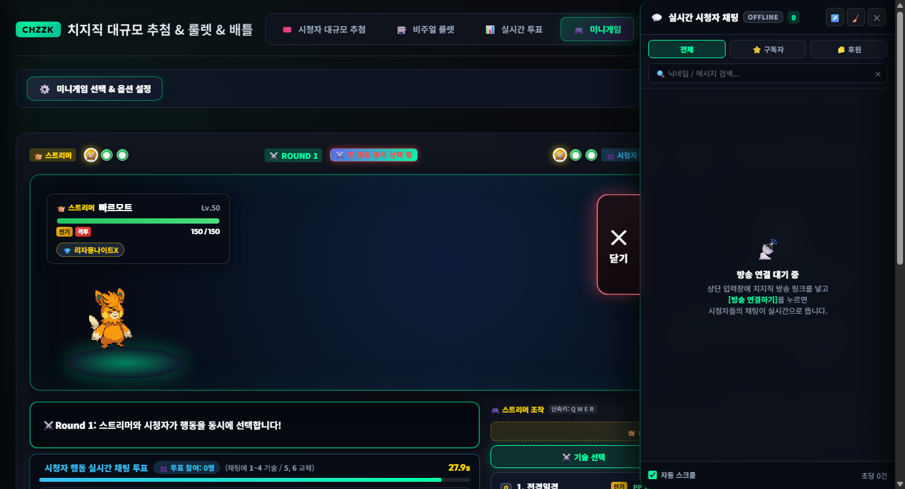
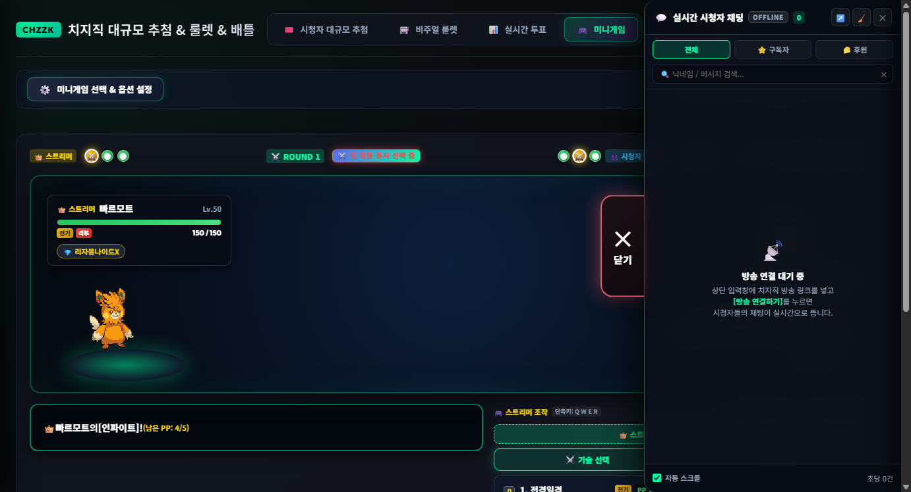
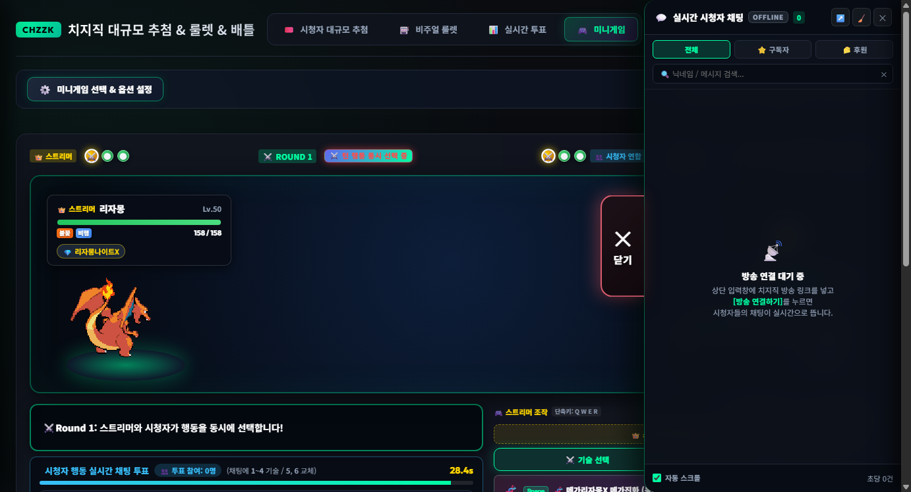

# 🚀 치지직 방송 플랫폼 v5.1.0 릴리즈 노트 (Release Notes)

## 📌 개요 (Overview)
- **버전**: v5.1.0 (Minor Release)
- **배포일자**: 2026년 9월 9일
- **핵심 키워드**: 포챔스(PokéChamps) 레귤레이션 M-C(시즌 M-6) 공식 출전 도감 100% 일치화, 미입국 19종 완전 제거 & 공식 신규 15종(푸크린/빠르모트/나이킹 등) 정식 입국, 효과음(SFX) 독립 볼륨 슬라이더 및 음소거 토글, 기술 효과음 매칭 전수 개편, 3중 방어적 기절(Faint) 가드, 단독 실행 파일(EXE) 리빌드

---

## 🏆 1. 포챔스(PokéChamps) 레귤레이션 M-C 공식 로스터 100% 동기화

공식 「포켓몬 챔피언스 (PokéChamps)」 2026년 가을 시즌인 **「레귤레이션 M-C (시즌 M-6)」**의 공식 도감 규정을 전수 대조하여, 규정에 존재하지 않던 포켓몬을 모두 배제하고 공식 신규 참전 포켓몬을 정식 등록했습니다.

### ① 포챔스 미입국 19마리 전면 제거
포챔스 공식 규정상 출전이 금지되거나 미출전 상태인 19개 항목을 완전히 제거하여 공식 대회 규정과 완벽히 통일했습니다:
- **초전설 / 전설 (3종)**: 코라이돈, 미라이돈, 우라오스
- **사흉수 (4종)**: 총지엔, 파오젠, 딩루, 위유이
- **패러독스 포켓몬 (6종)**: 날개치는머리, 무쇠보따리, 무쇠손, 무쇠독나방, 고동치는달, 무쇠무인
- **미입국 일반 포켓몬 (6종)**: 다투곰, 어써러셔, 싸리용, 토오, 모스노우, 두랄루돈

### ② 공식 레귤레이션 M-C 실제 신규 참전 15마리 완벽 입국
포챔스 M-C 정식 도감에 신규 등재된 15마리의 종족값, 대표 실전기(PP 포함 4개), 한글 데이터, 2D 도트 스프라이트(전면/후면 총 30종)를 로컬에 영구 내장했습니다:
- **1세대**: **푸크린** (#40), **페르시온** (#53), **파오리** (#83), **마임맨** (#122)
- **3세대**: **꿀꺽몬** (#317)
- **6세대**: **고고트** (#673)
- **8세대**: **폭슬라이** (#828), **케오퍼스** (#853), **나이킹** (#863), **창파나이트** (#865), **찌르성게** (#871)
- **9세대**: **빠르모트** (#923), **올리르바** (#930), **시비꼬** (#931), **마피티프** (#943)

*(※ M-C 공식 참전작인 보만다, 갑주무사, 고릴타, 에이스번, 인텔리레온, 스트린더, 에써르, 드닐레이브 및 신규 메가진화 6종은 온전히 유지됩니다.)*

### ③ 공식 258마리 체제 확립
- 공식 기본 231종 + 폼체인지/리전폼 27종 = **공식 258마리 엔트리** 체제를 확립했습니다.
- 상단 배틀 모드 타이틀, 팀 편성 버튼, 엔트리 픽커 모달의 명칭을 공식 258마리 · 레귤레이션 M-C로 통일했습니다.

---

## 🔊 2. 효과음(SFX) 독립 볼륨 조절 & 원클릭 음소거 시스템

BGM과 완전히 분리되어 작동하는 독립 효과음 제어 시스템을 구축했습니다.

### ① 2계통 오디오 엔진 완벽 스케일링
- **실제 오디오 파일 (Audio.volume)**: 지정한 효과음 볼륨(0%~100%)과 음소거 상태가 모든 효과음 파일 재생 시 즉각 100% 비례 스케일링됩니다.
- **Web Audio API 합성음**: 마스터 SFX 게인 노드(sfxDest)를 신설하여 절차적 오실레이터 합성 효과음(타격음, 피격음 등)도 유저 볼륨에 맞춰 부드럽게 감쇠/증폭됩니다.
- **영구 보존**: localStorage(poke_sfx_volume, poke_sfx_enabled)에 자동 동기화되어 앱 재실행 시에도 볼륨과 음소거 상태가 유지됩니다.

### ② 직관적인 3개 영역 UI 컨트롤
- **포켓몬 설정 툴바**: 상단 BGM 알약 옆에 [ 🎵 ──●── 70% | 🔊 ──●── 70% ] 형태로 나란히 배치.
- **배틀 아레나 상단 HUD**: 전광판 바로 아래에 일체형 미니 오디오 바를 배치하여 전투 도중 실시간 볼륨 조절 가능.
- **애니메이션 스튜디오 모달**: SE 테스트 전용 볼륨 슬라이더 및 주요 카테고리별 즉시 청음 버튼 제공.

---

## ⚡ 3. 기술 효과음(SFX) 매칭 전수 개편

등록된 모든 기술의 사운드 파일 매핑을 전수 검사하여 어색하거나 잘못 매칭되었던 사운드를 고품질 전용 사운드로 전면 교체했습니다:

| 기술명 | 기존 매칭 사운드 | 발견된 문제점 | 수정된 사운드 | 개선 효과 |
| :--- | :--- | :--- | :--- | :--- |
| **10만볼트, 번개, 볼트체인지, 오버드라이브** | Earth4.m4a | 정규식 오류로 전기 기술에 **진흙 둔탁음** 발생 | eam.wav | 강력한 고전압 전격 빔 사운드로 변경 |
| **기습, 탁쳐서떨구기, 유턴** | Damage1.m4a | 공격 시전 시 포켓몬이 **피격 신음**을 내던 문제 | PRSFX- Bullet Punch.wav | 빠르고 날카로운 물리 타격음으로 변경 |
| **불꽃춤** | charge.wav | '춤' 키워드로 인해 랭업 버프음 재생 | Fire1.m4a | 화려한 특수 불꽃 화염 방사음으로 변경 |
| **대검돌격, 브레이브버드, 10만마력, 액셀브레이크** | Blow1.m4a | 대표 돌진기임에도 타격감이 약했음 | Crash.m4a | 묵직하고 웅장한 충돌/격돌 굉음 적용 |
| **탁류, 하이드로펌프** | Blow1.m4a | 물 속성 고위력기 타격감 부족 | PRSFX- Muddy Water.wav | 거센 급류 및 흙탕물 쇄도음 적용 |
| **파동탄, 철제광선, 폭음파, 용성군** | Blow1.m4a | 폭발적 에너지감 부재 | eam.wav / Crash.m4a | 폭발적인 에너지 파동 사운드 적용 |
| **에어슬래시, 폭풍** | Blow1.m4a | 바람 속성 효과음 부재 | PRSFX- Air Slash1.wav | 예리한 풍압 참격음 적용 |

---

## 🛡️ 4. 배틀 엔진 안정성 강화 & 3중 방어적 기절 감지 가드

- **체력 0 좀비 버그 원천 차단**: 데미지 계산 및 모션 연출 도중 발생할 수 있는 스코프 예외로 기절 판정이 누락되지 않도록 executeBattleTurnSequence, handleRoundEndEffects, startSimultaneousPokeTurn 3개 핵심 루프 전반에 방어적 기절 감지 가드를 구축했습니다.
- **메가진화 특성 & 주얼 도구 판정 정상화**: 메가진화 시 진화체의 고유 특성이 인스턴스에 즉시 상속되도록 개선하고, 한국어 속성명과 영문 도구 ID 간 매핑을 보완하여 주얼(Gem) 1.3배 부스트 및 소모 처리를 정상화했습니다.

---

## 📦 5. 단일 실행 파일 (EXE) 최신 빌드

- **빌드 파일**: dist/치지직추첨기.exe (19.9MB)
- **외부 종속성 제로**: Python 환경이나 외부 라이브러리 설치 없이 Windows 환경에서 더블 클릭만으로 즉시 구동 가능합니다.
