# 🚀 치지직 방송 플랫폼 v5.2.0 릴리즈 노트 (Release Notes)

## 📌 개요 (Overview)
- **버전**: v5.2.0 (Minor Release)
- **배포일자**: 2026년 9월 13일
- **핵심 키워드**: 포켓몬 배틀 「시청자 진영 대항전 (Viewers Faction Battle)」 모드 공식 출시, 시청자 직접 진영 선택(Viewer Choice Mode) & 50:50 자유 채팅 무작위 셔플(Fisher-Yates Draft), 양측 영화 크레딧 롤링 전광판(Dual Cinematic Scrolling Billboards), 실시간 투표 네온 발광 효과(Live Vote Glow), **기술창 완벽 좌우 대칭 디자인(Symmetrical Move Decks)**, **시청자 내전 VIP/전광판/명단/영광의 참가자 원클릭 UID & 채팅 인스펙터**, **메가진화 선택 번호(`🧬 메가1~4`) 표시 & 실시간 채팅 투표 연동**, 지각생 자동 밸런싱(Latecomer Auto-Balancing), 중계자(스트리머) 제어 센터, 단독 실행 파일(EXE) 리빌드

---

## 👥 1. 포켓몬 배틀 「시청자 진영 대항전 (레드팀 vs 블루팀)」 모드 공식 출시

스트리머와 시청자가 대결하던 기존 `👑 스트리머 vs 시청자` 모드에 더하여, 방송에 참여한 시청자들이 두 진영으로 나뉘어 서로의 포켓몬을 지휘하며 두뇌 싸움을 펼치는 **「시청자 진영 대항전 (Viewers Faction Battle)」** 모드가 정식 추가되었습니다!

- **모드 선택**: 배틀 대기실 상단 및 환경설정 서랍에서 `👑 스트리머 vs 시청자` ↔ `🔴 👥 시청자 진영 대항전 🔵`을 원클릭으로 손쉽게 전환할 수 있습니다.
- **맞춤형 진영 설정**: 진영 명칭(기본: `레드팀` / `블루팀`)을 스트리머가 원하는 이름(예: `침착맨팀` vs `궤도팀` 등)으로 자유롭게 커스텀할 수 있습니다.
- **모집 시간 조절**: 방송 템포에 맞추어 모집 시간을 15초, 20초, 30초, 45초, 60초 중 유연하게 선택할 수 있습니다.

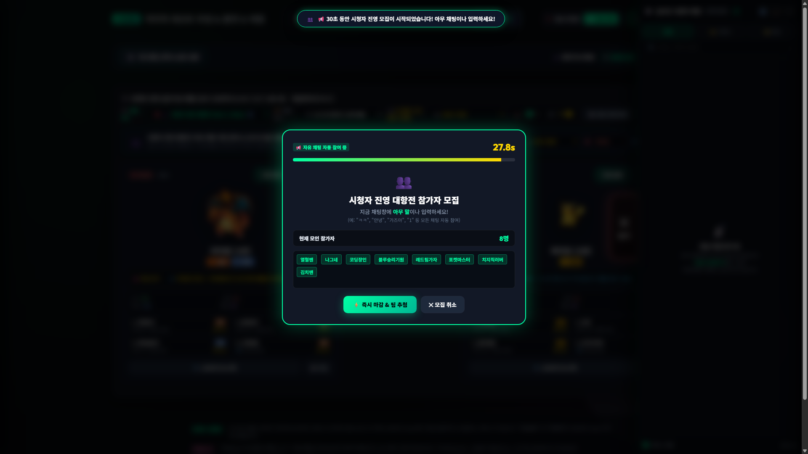

---

## 🚩 2. 진영 편성 방식 선택: 「시청자 직접 선택」 vs 「50:50 무작위 균등 추첨」

배틀 대기실 상단 및 환경설정 서랍에서 스트리머가 원하는 진영 모집 방식을 자유롭게 선택할 수 있습니다:

1. **🚩 시청자 직접 진영 선택 모드 (Viewer Choice Mode)**:
   - 시청자가 채팅창에 원하는 팀 번호나 이름을 입력하여 가입할 진영을 직접 결정합니다.
     - 🔴 **레드팀 입단**: `1`, `!1`, `레드`, `레드팀`, `red`, 커스텀 레드팀 이름
     - 🔵 **블루팀 입단**: `2`, `!2`, `블루`, `블루팀`, `blue`, 커스텀 블루팀 이름
   - **실시간 2단 버킷 UI**: 모집 모달에 좌우 분할된 레드팀/블루팀 버킷이 나타나며, 시청자가 채팅을 입력하는 즉시 해당 진영 명단에 애니메이션 뱃지로 등재됩니다.
   - **자유로운 팀 이적 (Team Transfer)**: 모집 시간이 끝나기 전이라면 다른 팀 키워드를 입력해 언제든지 진영을 변경할 수 있습니다 (이전 팀에서 자동 제거 후 새 팀으로 실시간 이동).
   - **인원 불균형 대응**: 시청자들의 선택에 따라 5:2, 8:3 등 인원수가 다르더라도, 포켓몬 배틀 턴 행동은 각 팀별 **다수결(Majority Vote)**로 민주적으로 결정되므로 정상적이고 박진감 넘치는 대결이 진행됩니다.
   - **지각생 스마트 편입**: 배틀 도중 난입한 시청자가 팀 키워드(`레드`/`블루`)를 입력하면 해당 팀으로 즉각 투입되며, 일반 숫자만 입력한 경우 인원수가 적은 팀으로 자동 밸런싱됩니다.

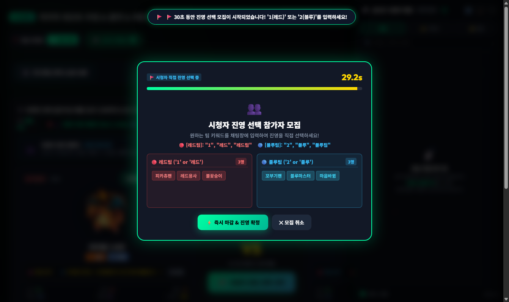
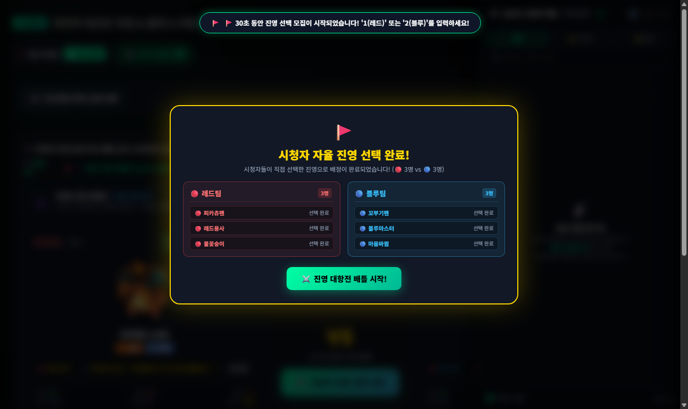

2. **🎲 50:50 자유 채팅 무작위 균등 배정 모드 (Random Equal Mode)**:
   - **아무 말이나 치면 자동 접수**: 모집 시간 동안 시청자가 채팅창에 `"ㅋㅋ"`, `"안녕하세요"`, `"가즈아"` 등 어떤 일상 채팅이라도 치면 치지직 UID 기준으로 즉시 접수됩니다.
   - **정확한 50:50 배정**: Fisher-Yates 셔플 알고리즘으로 참가자 풀을 완벽하게 뒤섞은 후, 양 진영에 50:50(황금 밸런스)으로 공정하게 균등 배분합니다.

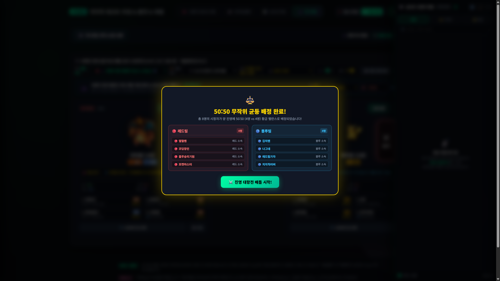

---

## 🎬 3. 양측 영화 크레딧 롤링 전광판 (Dual Cinematic Scrolling Billboards)

배틀 경기장 양옆에 사이버 스타디움 감성의 독립형 LED 전광판이 설치되어 방송 화면의 몰입감을 극대화합니다:

- **영화 엔딩 크레딧 스크롤 연출**: 상하단에 부드러운 페이드아웃 그라데이션 마스크(`linear-gradient`)를 적용하여, 소속 팀원들의 닉네임 칩이 극장 엔딩 크레딧처럼 위에서 아래로 끊임없이 유려하게 흘러내립니다.
- **실시간 투표 네온 발광 (Live Vote Glow)**:
  - 턴 진행 중 특정 시청자가 채팅으로 기술(`1`~`4`)이나 교체(`5`,`6`)를 투표하면, 전광판 속 해당 시청자의 닉네임 카드가 **황금빛 네온(⚡)**으로 찬란하게 반짝입니다!
  - 닉네임 우측 뱃지에 시청자가 선택한 행동(`1번`, `2번`, `메가1`, `교체` 등)이 즉각 갱신되어, "내가 지금 배틀에 직접 개입하고 있다"는 강력한 참여감을 선사합니다.

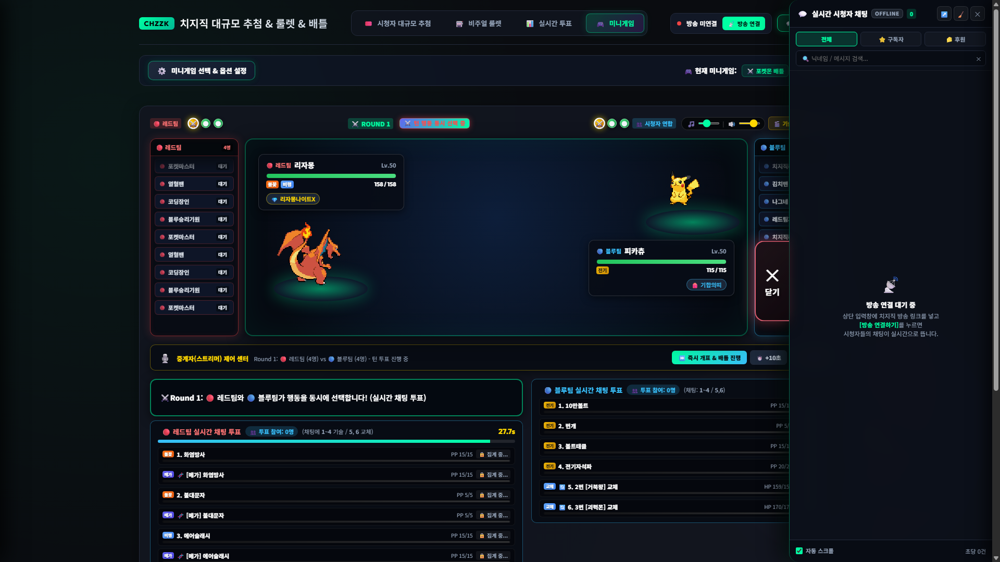
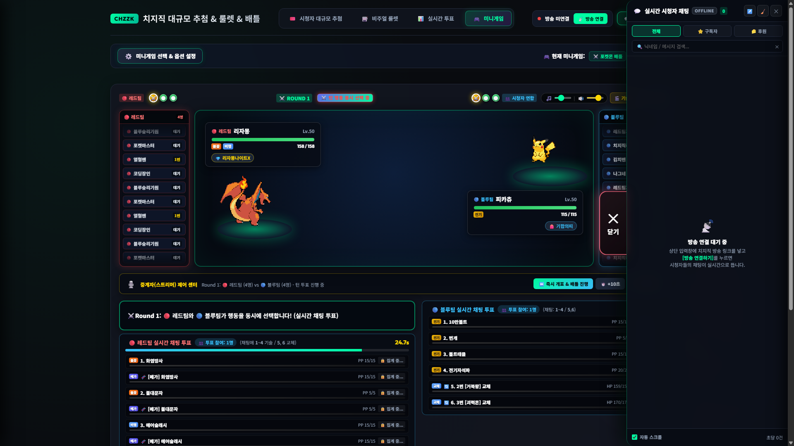

---

## ⚖️ 4. 기술창 완벽 좌우 대칭 디자인 & 높이 1:1 일치 (Symmetrical Move Decks)

기존 좌우 기술창의 높이 불일치와 비대칭성을 해결하여 완벽한 방송 대칭 레이아웃을 구현했습니다:

- **전폭 다이얼로그 & 단일 턴 타이머 바**: 상단 배틀 상황 메시지와 턴 타이머 프로그레스 바를 단일 전폭(`100%`) 바 형태로 통합.
- **1:1 정확한 대칭 그리드 (`1fr 1fr`)**: 레드팀과 블루팀 기술창의 높이를 278px로 완벽히 동일화(오차 0px).
- **2열 페어링 그리드**:
  - 일반 기술(`1`~`4`)과 메가진화 기술(`메가1`~`4`)을 2열로 나란히 배치.
  - 교체 행동(`5`, `6`)도 2열 분할 카드로 배치하여 완벽한 시각적 균형감 완성.

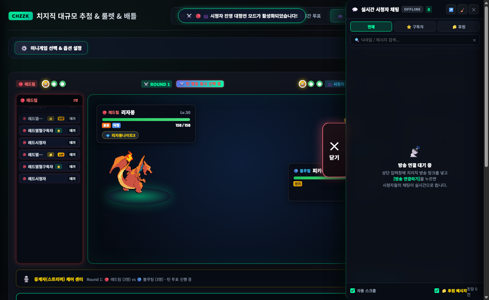

---

## 🔍 5. 시청자 내전 VIP / 전광판 / 명단 / 영광의 참가자 원클릭 UID & 채팅 인스펙터

배틀에 참여한 VIP, 후원자, 일반 시청자의 상세 정보와 고유 UID를 방송 중 언제든 검사할 수 있습니다:

- **전광판 칩 클릭 인스펙터**: 경기장 좌우측 전광판 닉네임 칩을 클릭하면 해당 시청자의 고유 UID, 원클릭 복사 버튼, 후원/구독 뱃지, 실시간 채팅 내역 모달 즉시 팝업.
- **진영 전체 명단(`factionRosterModal`)**: `[ 👥 진영 명단 ]`에서 참가자 클릭 시 `🔍 UID 확인` 뱃지와 함께 상세 인스펙터 연동.
- **승리 결과 모달 '영광의 참가자' 인터랙티브 칩**:
  - 결과창의 승리 팀원 전원을 골드 테두리 인터랙티브 칩(`glory-user-chip`)으로 개편.
  - 클릭 시 즉시 시청자 정보 창 호출 및 상단에 `[📋 전체 명단 & 검색]` 버튼 제공.
- **3중 레이어 z-index 스택 아키텍처**: 결과 모달(`1100`) ➔ 진영 명단 모달(`1150`) ➔ UID 인스펙터(`1250`) 순으로 충돌 없이 부드럽게 오버레이.

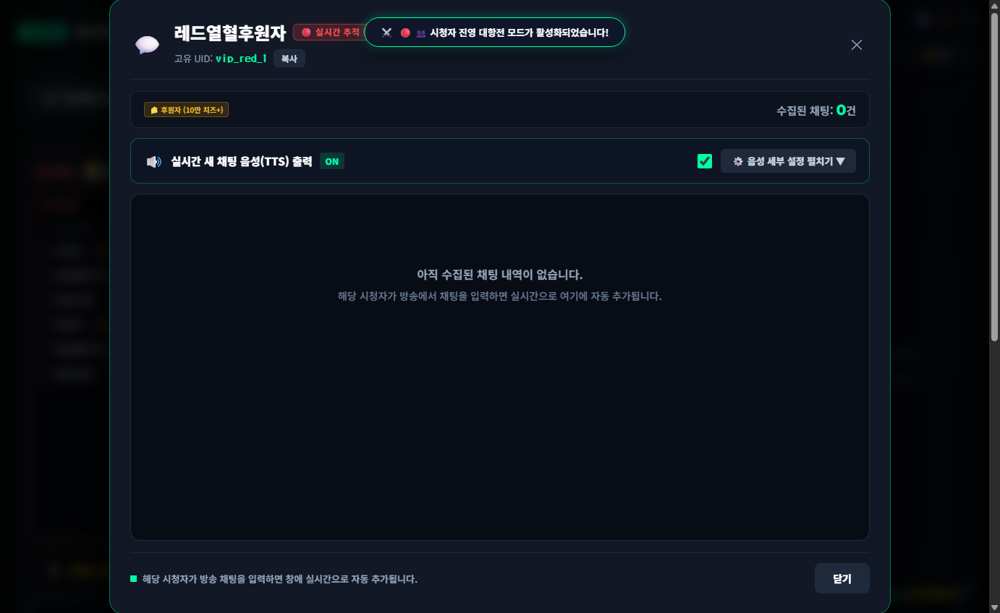
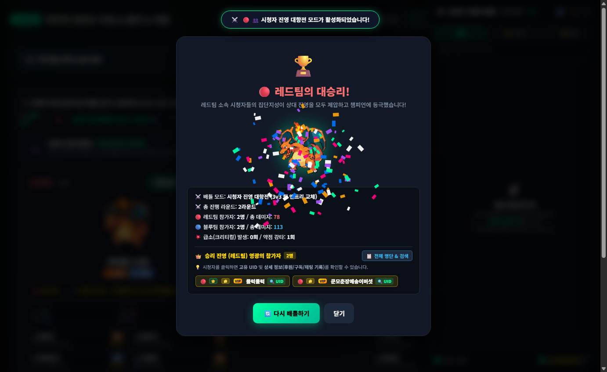
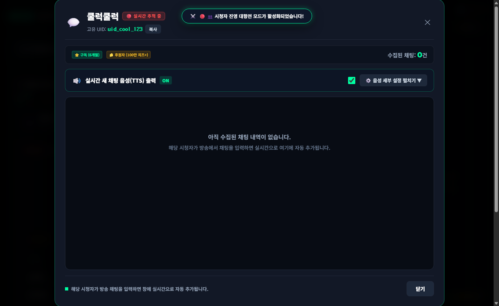

---

## 🧬 6. 메가진화 선택 번호(`메가1~4`) 명시 & 실시간 채팅 투표 연동

시청자와 스트리머 모두 메가진화를 직관적으로 선택할 수 있도록 전면 개선되었습니다:

- **메가진화 카드 라벨 번호 삽입**:
  - 기존 번호 없던 `🧬 [메가] 화염방사` ➔ **`🧬 메가1. 화염방사`**, **`🧬 메가2. 불대문자`**, **`🧬 메가3. 에어슬래시`**, **`🧬 메가4. 도깨비불`** 로 명시.
- **HUD 상단 안내 자막 동적 실시간 반영**:
  - 3v3 메가진화 가능 시: `(채팅: 1~4 / 메가1~4 / 5,6)`
  - 1v1 메가진화 가능 시: `(채팅: 1~4 / 메가1~4)`
  - 메가스톤 미보유 또는 완료 시: `(채팅: 1~4 / 5,6)`로 자동 복귀.
- **채팅 투표 파서 강화 & 숫자 단축키 지원**:
  - `메가1` ~ `메가4`, `M1` ~ `M4`, `1메가` ~ `4메가`, `메가1번` ~ `메가4번` 전면 수용.
  - **숫자 단축키**: 3v3 모드에서 `7`, `8`, `9`, `10` 입력 시 `메가1`~`메가4`로 자동 매핑 (1v1 모드는 `5`~`8` 및 `7`~`10` 지원).
  - 전광판 칩에도 `메가1`, `메가2` 투표 뱃지가 실시간 발광 점등.

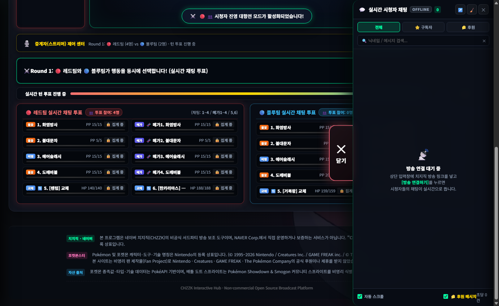
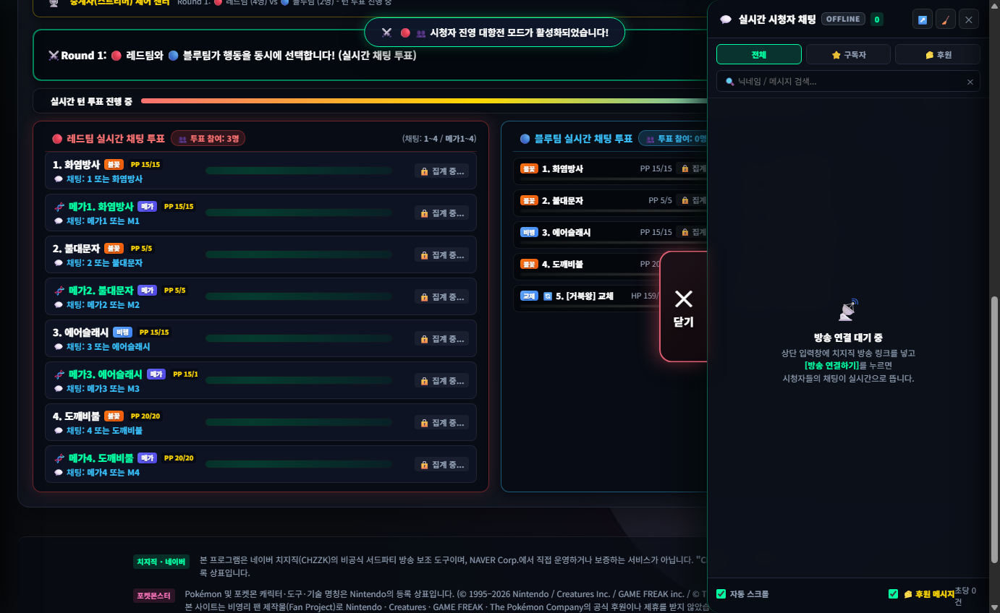

---

## 🔄 7. 지각생 자동 밸런싱 & 교체 투표 시스템

- **지각생 실시간 편입 (Latecomer Balancing)**: 모집 시간을 놓친 시청자가 배틀 도중 뒤늦게 채팅 투표를 입력하더라도 배제되지 않고, **그 시점에 인원수가 더 적은 팀으로 자동 배정**되어 게임 끝까지 양팀의 균등한 세력 균형을 유지합니다.
- **진영별 독립 기절 교체 투표**: 포켓몬이 쓰러졌을 때, 해당 진영 소속 시청자들만 15초간 다음 출전 포켓몬을 블라인드 채팅 투표로 결정합니다.
- **최다 투표 MVP 시상**: 승리 팀 확정 시, 가장 적극적으로 승리에 기여한 시청자를 집계하여 영예의 MVP 배지와 함께 축하 팡파레를 터뜨립니다.

---

## 🎙️ 8. 중계자(스트리머) 제어 센터 (Caster Control Bar)

진영 대항전 모드에서 스트리머는 배틀의 중계자(MC)이자 심판 역할을 수행합니다:

- **경기장 중앙 상단 제어 바**:
  - `[ ⏭️ 즉시 개표 & 배틀 진행 ]`: 투표 시간이 남아있더라도 스트리머가 원하는 타이밍에 즉시 개표하여 빠른 진행 가능.
  - `[ ⏱️ +10초 ]`: 시청자 투표가 치열하거나 접전일 때 시간을 10초씩 즉각 연장.
  - `[ 👥 진영 명단 ]`: 양 팀의 전체 소속 시청자 명단 팝업을 언제든 열람 가능.
- **양측 독립 실시간 투표 HUD**: 좌측에는 레드팀의 투표 현황, 우측에는 블루팀의 투표 현황이 독립적으로 렌더링되어 양 팀의 표심을 한눈에 중계할 수 있습니다.

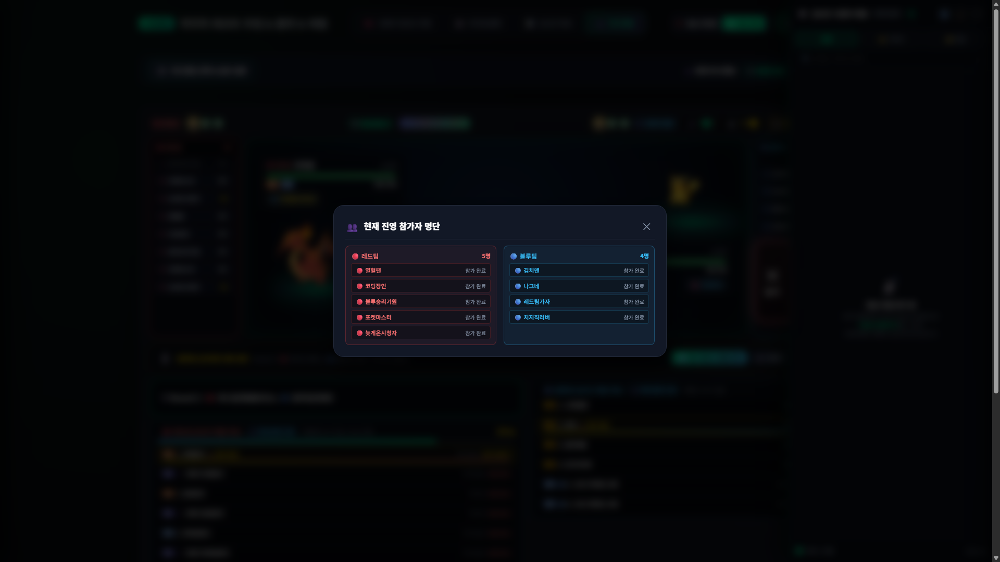

---

## 📦 9. 배포 및 실행 파일 (Standalone EXE)

- `치지직추첨기.spec`을 통해 모든 신규 CSS, 마크업, 사운드, 이미지 에셋이 내장된 윈도우 단일 실행 파일([`dist/치지직추첨기.exe`](file:///C:/Users/dlwjd/.gemini/antigravity/scratch/chzzk-raffle-app/dist/치지직추첨기.exe), 약 19.9 MB)이 최신 버전으로 안전하게 리빌드되었습니다.
- 기존의 `👑 스트리머 vs 시청자` 1v1 / 3v3 배틀 모드와 포챔스 레귤레이션 M-C 공식 258마리 도감 데이터도 완벽하게 보존되어 정상 구동됩니다.
